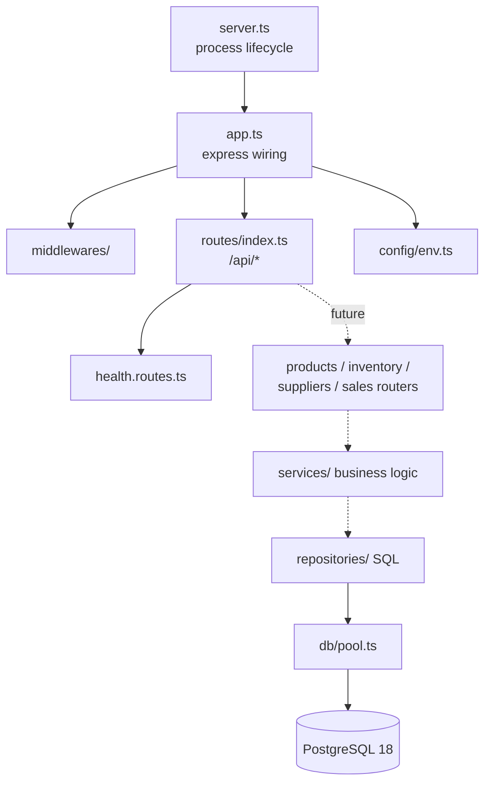

# Architecture — StockPilot

Foundation-stage architecture. This describes what is true **today**, plus the
boundaries that keep the codebase scalable as business modules arrive.

## Repository shape

A lightweight monorepo: two independently installable, independently runnable
applications plus shared documentation, sharing a single root `.gitignore` and
Git history.

```
StockPilot/
├── frontend/     React + TypeScript + Vite + Tailwind CSS   (port 5173)
├── backend/      Node.js + Express + TypeScript             (port 4000)
├── database/     schema migrations + data documentation
├── docs/         architecture, guides, future ADRs
├── .github/workflows/   CI (ci.yml); deployment workflows not yet added
└── docker-compose.yml   local PostgreSQL 18 only
```

Frontend and backend communicate over **REST** (`/api/*`). The session is an
HTTP-only cookie, so the browser holds no token and nothing is stored in
`localStorage`. There is no shared runtime package yet — the only things
genuinely shared are the API contract and the root tooling conventions, so a
premature `packages/shared` monorepo layer
was deliberately avoided.

## Backend layering

Dependencies point **inward only**: `routes → services → repositories → db`.
A layer may import from layers below it, never from layers above it.



| Layer | Responsibility | Never does |
| --- | --- | --- |
| `server.ts` | process lifecycle, listen, graceful shutdown, signal handling | handle requests |
| `app.ts` | middleware order, mounting routers | business logic |
| `config/env.ts` | read + validate process env once, at import time | read `process.env` elsewhere |
| `routes/` | HTTP shape only: parse, delegate, respond | SQL, business rules |
| `middlewares/` | cross-cutting concerns (404, errors, logging) | route-specific logic |
| `services/` *(planned)* | business rules and orchestration | touch `req`/`res` |
| `repositories/` *(planned)* | all SQL and row mapping | business rules |
| `db/pool.ts` | connection lifecycle, parameterised queries | schema creation |

**`config/env.ts` is the only module allowed to read `process.env`.** Everything
else imports the validated `env` object, so a missing variable fails once, at
startup, with a clear message — instead of surfacing as `undefined` deep inside a
request.

### Current API surface

| Method | Path | Response |
| --- | --- | --- |
| `GET` | `/api/health` | `{"status":"ok","service":"stockpilot-api"}` |

`/api/health` is intentionally dependency-free — it does not query PostgreSQL, so
a database outage can never make the HTTP process look dead.

## Authentication and tenancy

Two invariants hold the whole thing together.

**1. Identity comes from the session, never the request.** `requireAuth`
(`middlewares/requireAuth.ts`) is the single place a request gains an identity.
It reads only the HTTP-only session cookie, then resolves the user and their
business in a single join:

```sql
auth_sessions → users → businesses
```

`businessId` is therefore selected from the database, never parsed from a body,
query parameter or header. Repositories reinforce this: any lookup driven by
client-supplied identity takes an explicit `businessId`, so a forgotten scope is
a compile error rather than a silent data leak.

**2. Layers point inward.** `routes → services → repositories → db`. Services
never see `req`/`res`; repositories never contain business rules.

| Concern | Lives in | Notes |
| --- | --- | --- |
| HTTP shape, validation, cookies | `routes/auth.routes.ts` | Zod schemas in `services/auth.schemas.ts` |
| Registration / login / session logic | `services/auth.service.ts` | The only place transactions are opened for auth |
| All SQL | `repositories/*.repository.ts` | Parameterised queries only |
| Password hashing | `security/password.ts` | Argon2id, OWASP parameters |
| Token generation | `security/session.ts` | 256-bit random; only the SHA-256 digest is stored |
| Cookie attributes | `security/cookies.ts` | HttpOnly, SameSite, Secure |
| Identity + role gates | `middlewares/requireAuth.ts` | `requireAuth`, `requireRole` |
| Throttling | `middlewares/rateLimit.ts` | Per-endpoint limits |

### Why server-side sessions rather than a stateless JWT

`auth_sessions` stores a hash of the token, not the token. That costs one lookup
per request, and buys three things a stateless JWT cannot: `logout` genuinely
revokes access; "sign out everywhere" and per-session revocation are possible
later; and a database disclosure does not hand over usable credentials. The
schema also already carries `expires_at` and `last_used_at`, so adding refresh
tokens later is an additive change rather than a redesign.

### Redaction happens once

`services/auth.service.ts` exposes a single `AuthenticatedUser` shape that has no
`password_hash` field at all. Redaction at the type boundary — rather than at
each call site — means a hash cannot reach a response body by accident.

### Error contract

`src/errors.ts` defines a typed `AppError` hierarchy carrying the HTTP status and
a stable machine-readable code. The terminal error handler returns `AppError`s
as-is and everything else as a generic 500 with no internal detail, so stack
traces never reach a client.

## Database

The backend holds a single lazily-created `pg` connection pool per process
(`db/pool.ts`). It is opened on first use, reports idle-client errors without
crashing, supports `withTransaction`, and is drained on `SIGTERM`/`SIGINT`.

Connection settings are defined exactly once, in `db/config.ts`
(`buildClientConfig()`), which reads the validated `env` object. Both the
application pool and the migration runner build their clients from that one
function, so a migration can never be pointed at a different database than the
API — a bug that is otherwise very hard to diagnose.

**No tables are created by application code.** The schema is applied exclusively
through versioned migrations committed under `database/migrations/` and run with
`node-pg-migrate` via `db/migrate.ts`. Migrations run inside a single
transaction, under a PostgreSQL advisory lock, with out-of-order detection
enabled. See [`database/README.md`](../database/README.md).

`db/migrate.ts` is tooling: excluded from the production build, never imported by
the API.

## Frontend

- **Vite 8** dev server / bundler, **React 19**, **TypeScript 6** (strict).
- **Tailwind CSS 4** via the `@tailwindcss/vite` plugin — no PostCSS config
  file, no separate `tailwind.config.js`; theme tokens are declared with
  `@theme` in `src/index.css`.
- **Strict type-check** in `tsconfig.app.json` plus a separate
  `tsconfig.node.json` for build tooling; `tsc -b` type-checks both.
- **ESLint 10** flat config with `typescript-eslint`, `react-hooks` and
  `react-refresh`.

### Talking to the API

`vite.config.ts` proxies `/api` → `http://localhost:4000` in dev. The frontend
therefore calls **relative** `/api/...` paths: no hard-coded backend host, and
CORS never enters the picture locally. `VITE_API_BASE_URL` exists in
`.env.example` for the case where a separate API origin is genuinely needed.

## Security posture

- **No secrets in source control.** `.gitignore` blocks `.env`, `.env.*` and
  common key/cert extensions; `.env.example` files are the committed contract
  and contain placeholders only.
- **Nothing typed as `VITE_*` is secret** — those values are inlined into the
  public browser bundle.
- **Parameterised SQL only**; `query()` takes a values array, never string
  interpolation.
- `app.disable('x-powered-by')`; CORS is an explicit origin allow-list from
  `CORS_ORIGINS`, not `*`.
- Error responses never leak stack traces in production; details go to the
  server log only.

## Scaling path (not built yet)

Each of these is a deliberate seam, not existing code:

- **Modules** → new `routes/x.routes.ts` + `services/` + `repositories/`, mounted
  in `routes/index.ts`. No changes to `app.ts`.
- **Migrations** → `npm run migration:create -- <slug>`, then `migration:up`. No
  application change required. The test suite applies the same migrations to its
  own database on every run, so a broken migration fails CI.
- **Auth** → already built: `routes/auth.routes.ts` + `services/auth.service.ts`
  + `repositories/`. The seam for a future refresh-token flow is
  `auth_sessions` plus `security/session.ts`.
- **New business module** → new `routes/x.routes.ts`, `services/x.service.ts`
  and `repositories/x.repository.ts`, mounted in `routes/index.ts`. Put
  `requireAuth` on the router and take `businessId` from `req.auth`; never accept
  a tenant from the request.
- **Docker** → `docker-compose.yml` already isolates the `db` service, so
  frontend/backend services can be added beside it.
- **CI** → `ci.yml` already runs `lint`, `typecheck`, `build` for the app and the
  migrations, plus the database-backed test suite against a throwaway PostgreSQL
  service container. Deployment is not implemented.
